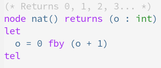

# heptagon-mode
Emacs mode for Heptagon.

## Functionality
Provides syntax highlighting for every Heptagon keyword, type and single-line
comment.

## To add
1. Syntax highlighting for multiline comments.
2. Syntax highlighting for `node`'s and `fun`'s names.
